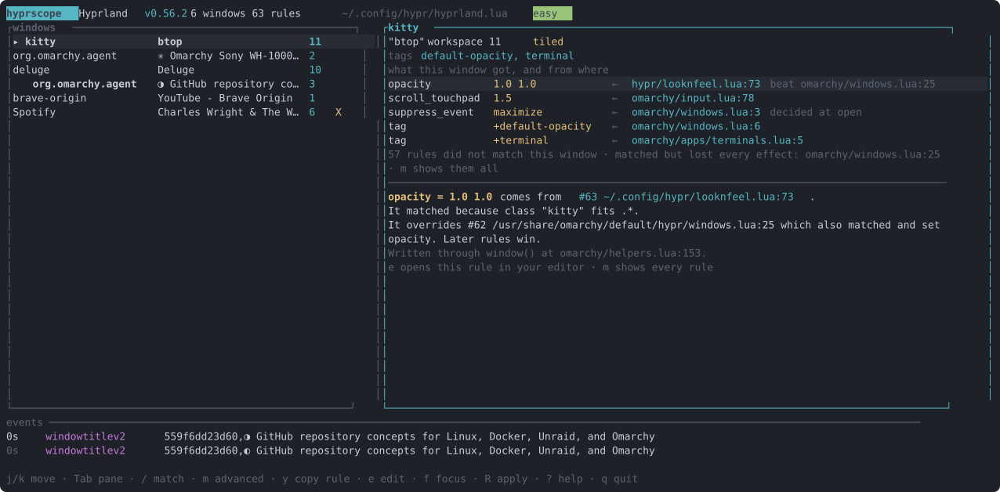
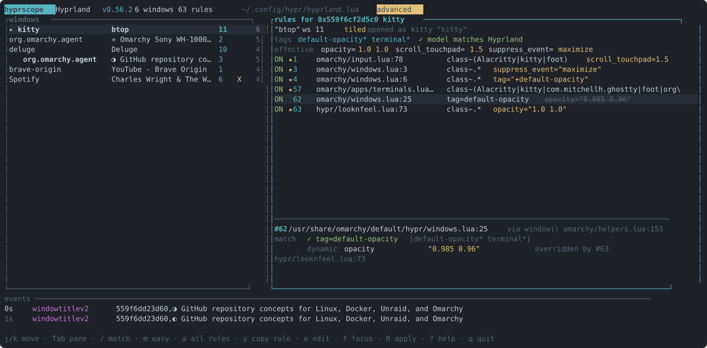

# hyprscope

**See why every Hyprland window landed where it did, and which rule did it.**

hyprscope loads your `hyprland.lua`, captures every `hl.window_rule()` with the
file and line that made it, and evaluates those rules against your open windows
exactly the way Hyprland does: every predicate must hold, rules run top to
bottom, the last match wins, static effects only ever see the initial class and
title. Then it shows you the verdict.


No more `hyprctl clients`, squint, edit, reload, relaunch, repeat.

Easy mode (the default) answers one question per row: *what did this window
get, and from where*. Advanced mode (`m`, or `hyprscope --advanced`) shows
every rule with its predicates, whether it matched at open and now, and which
later rule overrode it.





## Why

Hyprland 0.53 rewrote window rules and 0.55 moved the config to Lua; hyprlang
support is being dropped after one or two releases. The questions in the
discussions board did not change: *why did this window float*, *why didn't my
rule fire*, *why does the title match but nothing happens*, *which of my three
opacity rules is the one that counts*. The compositor offers `hyprctl clients`
and a rolling log that never mentions rules. hyprscope answers with a source
location, and it does it before you reload: save a rule in your editor and the
verdicts update while Hyprland is still running the old config.

```
$ hyprscope why brave
0x559f6d180d90 brave-origin "Hyprland Wiki - Brave Origin"  ws 1  (opened as brave-origin "New Tab - Brave Origin")
  tags: default-opacity*  ✓ model agrees with Hyprland

  effective
    opacity              1.0 1.0                  #63 ~/.config/hypr/looknfeel.lua:73
    suppress_event       maximize                 #3 /usr/share/omarchy/default/hypr/windows.lua:3

  rules   O = matched at open (static effects), N = matches now (dynamic effects), ★ = wins
  ON #3         /usr/share/omarchy/default/hypr/windows.lua:3  class~.*
        static  suppress_event     "maximize"               ★
  ON #4         /usr/share/omarchy/default/hypr/windows.lua:6  class~.*
        dynamic tag                "+default-opacity"       ★
  ON #62        /usr/share/omarchy/default/hypr/windows.lua:25  tag=default-opacity
        dynamic opacity            "0.985 0.96"             overridden by #63 ~/.config/hypr/looknfeel.lua:73
  ON #63        ~/.config/hypr/looknfeel.lua:73  class~.*
        dynamic opacity            "1.0 1.0"                ★
```

That output found a real bug on the machine it was written on: Omarchy's
browser rule matches `[bB]rave-browser`, but Brave now reports the class
`brave-origin`, so the window never gets the `chromium-based-browser` tag.
`hyprscope why brave --all` shows the failing predicate:

```
  ·· #11        /usr/share/omarchy/default/hypr/apps/browser.lua:2  class~((google-)?[cC]hrom(e|ium)|[bB]rave-browser|…)
        ✗ class actual brave-origin
```

## Install

```
cargo install --git https://github.com/kevincardwell/hyprscope
```

Arch: `hyprscope` and `hyprscope-bin` PKGBUILDs live in `packaging/aur`.
Static musl binaries are attached to each GitHub release.

Requires Hyprland 0.55 or newer with the Lua config. hyprlang `.conf` files are
not supported: Hyprland's development branch has already removed that loader,
so a parser for it would be built for a format on its way out. Run hyprscope
inside the session you want to inspect; it finds the instance through
`HYPRLAND_INSTANCE_SIGNATURE`.

## Commands

| command | what it does |
| --- | --- |
| `hyprscope [--advanced]` | live TUI: windows left, verdicts right, updates on compositor events |
| `hyprscope why [ADDRESS\|CLASS]` | explain the focused window, or one given by address or class (`--all` shows non-matching rules, `--json` for scripts) |
| `hyprscope match EXPR` | list the open windows a match expression selects, e.g. `class:^kitty$ float:true` |
| `hyprscope rules` | every registered rule with its source location, grouped by file |
| `hyprscope lint` | static checks on the config plus live checks against open windows |
| `hyprscope watch` | stream compositor events and explain each window as it opens or changes |
| `hyprscope snippet [ADDRESS\|CLASS]` | print a ready-to-paste rule for a window (`--set float=true --set workspace=3`, `--title`, `--copy`) |

Every subcommand takes `--config PATH` to point at a different `hyprland.lua`.

### The TUI

**Easy mode** lists each effective value with the rule that set it, marks
static ones as "decided at open", names the rules it beat, and explains the
selected row in a sentence: which predicate held, what it overrode, which
wrapper wrote it. One dim line says how many rules did not match and which
matched but lost.

**Advanced mode** shows every rule, with:

```
O    matched when the window opened (initial class/title) → static effects applied
N    matches now (current class/title) → dynamic effects applied
★    this rule sets at least one effective value
s̶t̶r̶i̶k̶e̶  effect overridden by a later rule
```

| key | action |
| --- | --- |
| `m` | switch between easy and advanced |
| `j` `k` / arrows | move within the pane |
| `Tab` `h` `l` | switch between windows and rules |
| `/` | match expression; matching windows get a ◆, `n` jumps to the next one |
| `a` | advanced: toggle between rules touching this window and all rules |
| `e` `Enter` | open the selected rule in `$EDITOR` at its line |
| `y` | copy a ready-to-paste rule for the selected window (wl-copy) |
| `f` | focus the selected window in Hyprland |
| `R` | ask Hyprland to reload its config |
| `r` | re-read the config by hand; automatic whenever a watched file changes |
| `?` | help |

### Edit, check, apply

hyprscope watches every file a rule came from plus your entry config. Save a
change and the verdicts update immediately. Hyprland normally reloads on its
own a moment later and hyprscope follows the `configreloaded` event; when it
does not (`misc:disable_autoreload`, or a file Hyprland is not watching) a
badge says the edit is not applied yet and `R` asks for the reload.

### Snippets

`y` in the TUI, or `hyprscope snippet`, writes a rule for the selected window
using its *initial* class, in the dialect your config uses:

```
$ hyprscope snippet brave --set float=true --set 'workspace=special silent' --title
-- brave-origin "YouTube - Brave Origin"  (opened as brave-origin "New Tab - Brave Origin": static effects see these)
-- title matching: static effects (float, workspace, size…) only see the initial title
o.window({ class = "^brave-origin$", title = "^New Tab - Brave Origin$" }, { float = true, workspace = "special silent" })
```

Omarchy configs get `o.window(...)`, everyone else gets `hl.window_rule({...})`.
When other rules already set the same effect for that window, the snippet says
so, because a rule appended at the end wins.

The detail pane under the rule list shows each predicate with the actual value
it saw, whether the rule matched at open and now, and for every effect whether
it wins or which later rule overrides it. When a rule was reached through a
wrapper such as Omarchy's `o.window()`, the location points at the rule, and
the wrapper is listed as `via`.

### Match expressions

`prop:value` pairs separated by spaces, values optionally double-quoted, bare
word means `class`. Props and semantics are Hyprland's own: regex props
(`class`, `title`, `initial_class`, `initial_title`, `content`, `xdg_tag`)
must match the whole value and accept a `negative:` prefix; `tag` matches both
static `foo` and dynamic `foo*`; booleans are `float`, `xwayland`,
`fullscreen`, `pin`, `focus`, `group`, `modal`; `workspace` takes a workspace
selector.

```
hyprscope match 'tag:terminal float:false'
hyprscope match 'title:"Friends List"'
hyprscope match 'negative:kitty'
```

### Lint

```
$ hyprscope lint
warn  /usr/share/omarchy/default/hypr/apps/system.lua:54 #54  matches tag `pop` but no rule in this config ever sets it
      ↳ only a static tag from hl.dsp.window.tag could satisfy it
warn  /usr/share/omarchy/default/hypr/windows.lua:25 #62  matches 9 window(s) but every effect is overridden by a later rule on all of them
info  /usr/share/omarchy/default/hypr/apps/steam.lua:4 #36  static effect(s) size are decided once at open, when `title` is still the initial title (`Friends List` must match that)
      ↳ match initial_title explicitly, or use hl.on("window.title", …) with a dispatch
57 rule(s) match no open window; pass --unused to list them
63 rules checked against 9 open windows: 0 error(s), 3 warning(s), 9 note(s)
```

Static checks: unknown match props and effects (with a "did you mean"),
regexes that do not compile under RE2 rules, wrong value types, malformed
`opacity`, `pin` without `float`, empty match tables, tags nothing sets, rules
shadowed by an identical later rule, and the title trap above. Live checks: rules
whose every effect is overridden on every window they touch, static effects that
never applied because the rule only matches the *current* title, and any window
where hyprscope's computed tags disagree with what Hyprland reports, and
**near misses**: a class regex that matches no open window while an unclaimed
window has a class close to it, which is how the `brave-origin` drift above
shows up without anyone reading the config. `hyprctl configerrors` is folded in,
and a small advisory table flags upstream bugs relevant to your rules on the
Hyprland version you run (currently: `xwayland` matching reports on 0.56.x). Exit status is 1 when there are
errors, so it works as a pre-reload check.

## How it works

Hyprland keeps no runtime list of rules, and `hyprctl reload` tears the Lua
state down, so hyprscope does not talk to the compositor's Lua at all. It runs
your `hyprland.lua` in its own Lua 5.5 sandbox against a recording stand-in for
the `hl` table. `hl.window_rule()` stores the table and the call stack;
`hl.exec_cmd`, `hl.on`, `hl.timer`, `hl.dispatch` and every other entry point
are inert. `require`, `dofile`, `os.getenv` and `io` work as normal, so the
config resolves modules the same way it does under Hyprland (Omarchy's
`bootstrap.lua` is honoured as is).

The evaluator mirrors `src/desktop/rule` in the Hyprland tree: RE2 full-match
regexes with `negative:`, the tag keeper's `+`/`-`/toggle semantics and
non-strict `foo` / `foo*` matching, `truthy()` for booleans, the workspace
filter grammar (`name:`, `special:`, `r[1-4] s[false] n[s:dev] m[DP-1] w[2] f[-1]`),
the static/dynamic split of the effect table, and rule ordering with tag
propagation between rules. Window state comes from `hyprctl -j clients` over
the request socket; live updates come from the event socket.

As a check on itself, hyprscope recomputes each window's dynamic tags from the
rules and compares them with the tags Hyprland reports. The TUI and `why` show
"model agrees with Hyprland" when they match, and `lint` warns when they do not.

Things hyprctl does not expose are marked rather than guessed: `modal` is
assumed false, and workspace selectors that need per-window counts show `?`.

## Development

```
cargo build
cargo test
cargo clippy --all-targets -- -D warnings
```

The TUI can be driven headlessly for screenshots:

```
tmux new-session -d -s shot -x 150 -y 38 ./target/debug/hyprscope
tmux capture-pane -e -pt shot | python3 assets/ansi2svg.py 150 > assets/tui-easy.svg
```

`assets/demo.tape` regenerates the animated demo with
[vhs](https://github.com/charmbracelet/vhs) 0.11 (0.12.0 cancels its own
context before encoding and silently writes nothing).

## License

MIT
